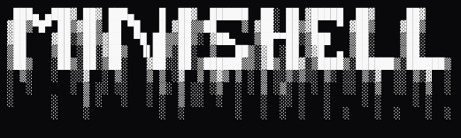

_This project has been created as part of the 42 curriculum by **nclavel**, **thlibers**_

<div align="center">
    <h1>STILL IN BUILD</h1>
     <!--  Mettre le logo en vert + mettre le fond en transparent (nom = bloody) --->
</div>

## Description:
Minishell is a **shell coded in pure C** with a full preservation history that keeps every command type in memory in a file, multi-piping which allows sending the standard output of a command into the standard input of another command, 7 built-in commands (cd, echo, export, unset, env, exit and pwd), ....

A shell is a ***C***ommand***L***ine user ***I***nterface ***(CLI)*** that bridges between the user and the system by interpreting the command typed by the user in his terminal. A lot of different shells are available, like sh, bash, zsh, fish and many more.

Doing this project has improved the understanding of how a UNIX system works and how a program can effectively treat a string to understand and execute in such a way as to do what the user wants to do.

## Instruction:
1. Build the project using `make` 
```sh
make
# OR 
make minishell
```
2. Launch the shell
```sh
./minishell
```
- Remove every compilation object file
```sh
make clean
```
- Remove every compilation object file and remove the compiled file
```sh
make fclean
```
- Remove every compilation object file and remove the compiled file and rebuild the project
```sh
make re
```

## Available features:
- [ ] Fully fonctional piping system
- [x] Fully preservation history
- [x] Fully fonctional builtin
- [ ] Condition priority
- [ ] File redirection
- [x] Complete expand token
- [ ] Heredoc support
- [ ] Wildcard expand

## Technical choise
**TODO**

{{{DEFINITION + EXPLICATION LEXER}}}
A lexer (also know as tokenizer) is a function that process a string to convert it into token sort with a type. That like sorting a bunch of word as noms, adjective, verb or any

To facilitate the execution of the different command we have create an AST (Abstract Syntax Tree). An AST is a data structure {{{DEFINITION AST}}}


## Example:
 <br>


## Ressources used:
- [Bash documentation](https://pubs.opengroup.org/onlinepubs/9699919799/functions/contents.html)
- [Readline documentation](https://web.mit.edu/gnu/doc/html/rlman_2.html#IDX113)
- [Function manual provided by linux](https://www.man7.org/linux/man-pages/index.html)
- [Tokenize a string](https://www.geeksforgeeks.org/cpp/string-tokenization-in-c/)
- [AST wikipedia](https://en.wikipedia.org/wiki/Abstract_syntax_tree)
- [Lexer analysis wikipedia](https://en.wikipedia.org/wiki/Lexical_analysis)
- [Our brain](https://github.com/thlibers/minishell)


<div align=center>
    <a href="https://github.com/thlibers/minishell/?tab=readme-ov-file#description">
        <ul>
            <b>
            <il>Made with ❤️ by</il>
            <il>thlibers</il> <!-- GOAT -->
            <il>nclavel</il>
            </b>
        </ul>
    </a>
</div>